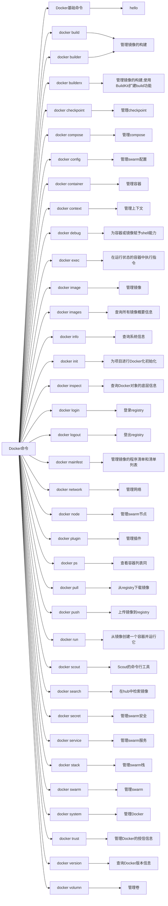

## Docker CLI Roadmap

```mermaid
flowchart LR

docker[Docker命令]			--> BASE[Docker基础命令]									 --> hello
docker[Docker命令]			--> build[docker build]										--> 管理镜像的构建
docker[Docker命令]			--> builder[docker builder]								--> 管理镜像的构建
docker[Docker命令]			--> buildx[docker builderx]								--> 管理镜像的构建,使用BuildKit扩建build功能																			  
docker[Docker命令]			--> checkpoint[docker checkpoint]					--> 管理checkpoint
docker[Docker命令]			--> compose[docker compose]								--> 管理compose
docker[Docker命令]			--> config[docker config]									--> 管理swarm配置
docker[Docker命令]			--> container[docker container]						--> 管理容器
docker[Docker命令]			--> context[docker context]								--> 管理上下文
docker[Docker命令]			--> debug[docker debug]										--> 为容器或镜像赋予shell能力
docker[Docker命令]			--> exec[docker exec]											--> 在运行状态的容器中执行指令
docker[Docker命令]			--> image[docker image]										--> 管理镜像
docker[Docker命令]			--> images[docker images]									--> 查询所有镜像概要信息
docker[Docker命令]			--> info[docker info]											--> 查询系统信息
docker[Docker命令]			--> init[docker init]											--> 为项目进行Docker化初始化
docker[Docker命令]			--> inspect[docker inspect]								--> 查询Docker对象的底层信息
docker[Docker命令]			--> login[docker login]										--> 登录registry
docker[Docker命令]			--> logout[docker logout]									--> 登出registry
docker[Docker命令]			--> manifest[docker mainfest]							--> 管理镜像的程序清单和清单列表
docker[Docker命令]			--> network[docker network]								--> 管理网络
docker[Docker命令]			--> node[docker node]											--> 管理swarm节点
docker[Docker命令]			--> plugin[docker plugin]									--> 管理插件
docker[Docker命令]			--> ps[docker ps]													--> 查看容器列表同
docker[Docker命令]			--> pull[docker pull]											--> 从registry下载镜像
docker[Docker命令]			--> push[docker push]											--> 上传镜像到registry
docker[Docker命令]			--> run[docker run]												--> 从镜像创建一个容器并运行它
docker[Docker命令]			--> scout[docker scout]										--> Scout的命令行工具
docker[Docker命令]			--> search[docker search]									--> 在hub中检索镜像
docker[Docker命令]			--> secret[docker secret]									--> 管理swarm安全
docker[Docker命令]			--> service[docker service]								--> 管理swarm服务
docker[Docker命令]			--> stack[docker stack]										--> 管理swarm栈
docker[Docker命令]			--> swarm[docker swarm]										--> 管理swarm
docker[Docker命令]			--> system[docker system]									--> 管理Docker
docker[Docker命令]			--> trust[docker trust]										--> 管理Docker的授信信息
docker[Docker命令]			--> version[docker version]       				--> 查询Docker版本信息
docker[Docker命令]			--> volumn[docker volumn]									--> 管理卷
```

