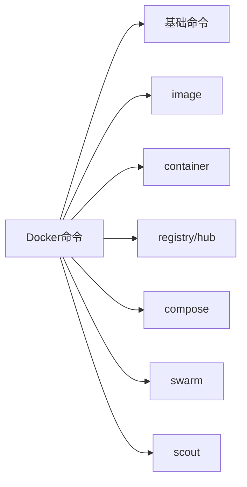

## Docker命令行分类

```mermaid
flowchart LR

docker[Docker命令]			--> BASE[基础命令]
docker[Docker命令]			--> IMAGE[image]
docker[Docker命令]			--> CONTAINER[container]
docker[Docker命令]			--> HUB[registry/hub]
docker[Docker命令]			--> COMPOSE[compose]
docker[Docker命令]			--> SWARM[swarm]
docker[Docker命令]			--> SCOUT[scout]

```

