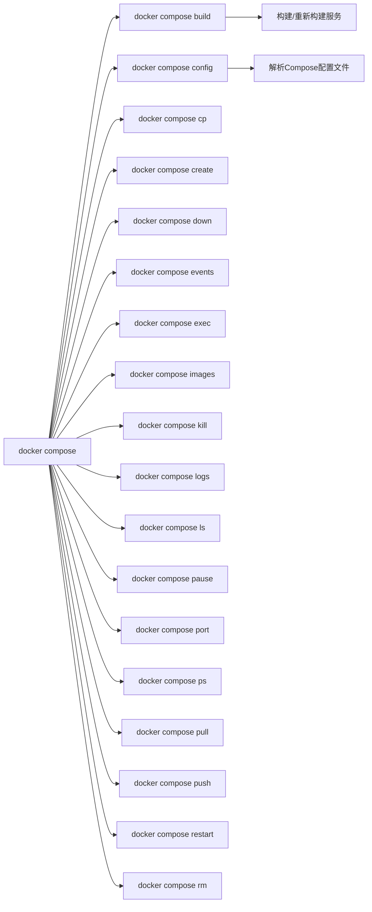

## Docker Compose CLI Roadmap

```mermaid
graph LR

compose[docker compose]				--> compose_build[docker compose build]				-->	构建/重新构建服务
compose[docker compose]				--> compose_config[docker compose config]			--> 解析Compose配置文件
compose[docker compose]				--> compose_cp[docker compose cp]	
compose[docker compose]				--> compose_create[docker compose create]
compose[docker compose]				--> compose_down[docker compose down]
compose[docker compose]				--> compose_events[docker compose events]
compose[docker compose]				--> compose_exec[docker compose exec]
compose[docker compose]				--> compose_iamges[docker compose images]
compose[docker compose]				--> compose_kill[docker compose kill]
compose[docker compose]				--> compose_logs[docker compose logs]
compose[docker compose]				--> compose_ls[docker compose ls]
compose[docker compose]				--> compose_pause[docker compose pause]
compose[docker compose]				--> compose_port[docker compose port]
compose[docker compose]				--> compose_ps[docker compose ps]
compose[docker compose]				--> compose_pull[docker compose pull]
compose[docker compose]				--> compose_push[docker compose push]
compose[docker compose]				--> compose_restart[docker compose restart]
compose[docker compose]				--> compose_rm[docker compose rm]
```

